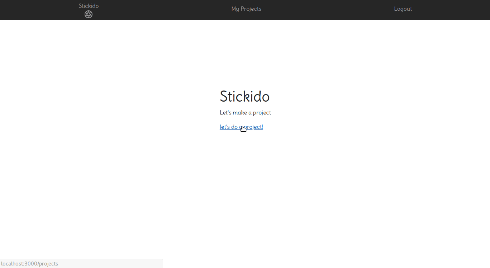

## Stickido
Productivity web app built on Ruby on Rails by @andrewtabudlo, @yuniegu3, and @maiya-22.

__Stickido__ lets you organize ideas and tasks by:

* Creating 'sticki notes' for any ideas or thoughts
* Creating tasks with due dates
* Seeing a visual representation of due dates on a timeline
* Sorting tasks by clicking on due dates 
(currently parent task due dates are required in orderr to show, subtask due dates are not required)

**Gems/Frameworks used:** Devise, Faker, Bootstrap, Gridstack, Sly 

## Example

